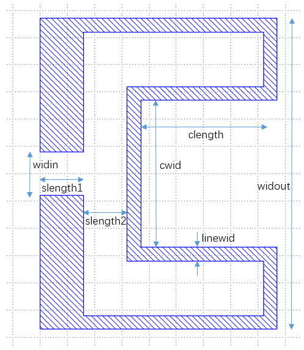
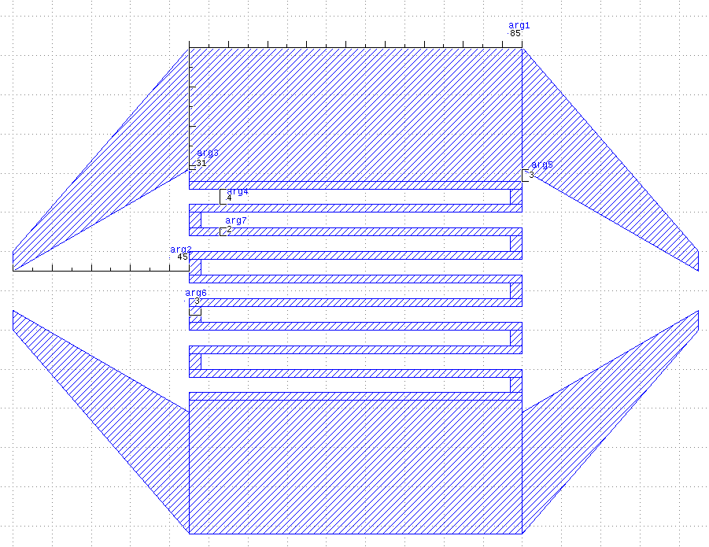
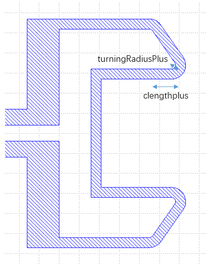
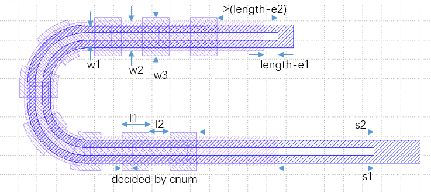
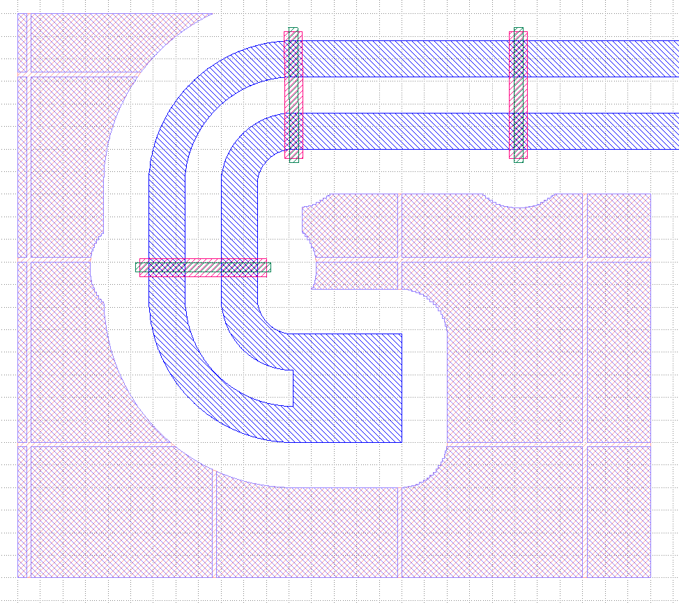

# 脚本绘图基础

KLayout提供了库pya作为python绘图的API, sqc-painter用paintlib进行了部分封装, 仍需对pya有一定了解

## pya和paintlib

**pya** 是KLayout提供的绘图接口,在脚本界面点击可以打开其帮助文档

**paintlib** 中提供了:
+ BasicPainter : 用于画基础图形的静态类
+ LinePainter : 用来画线的类
+ CavityBrush : 腔的画笔
+ CavityPainter : 用来画腔的类
+ PcellPainter : 用来画文字的类
+ TransfilePainter : 用来导入已有gds的类
+ IO : 处理输入输出的静态类

## layout, cell和layer

KLayout中,一个gds文件对应一个Layout,其中的图形放置在cell构成的树结构中  
每个图形自身有layer属性  

+ `layout,top = paintlib.IO.Start("guiopen")` 获取Layout以及最外层的cell  
+ `cell1 = layout.create_cell("Cavity1")` 创建cell
+ `layer1 = layout.layer(10, 15)` 创建layer

`layout.dbu = 0.001`设置单位长度为1nm

`top.insert(pya.CellInstArray(cell1.cell_index(),pya.Trans()))` 把cell插入到另一个cell中

## 作图精度

`layout.dbu = 0.001` 设置单位长度为1nm

`paintlib.IO.pointdistance=1000` 设置腔的精度,转弯处相邻两点的距离不会超过1000nm

**整数与浮点数** :

pya中涉及到具体图形的class分成了两大类:
+ 名字以D开头的`DPoint,DEdge,DPolygon,DCplxTrans`等,以浮点数的形式运算和储存图形
+ `Point,Edge,Polygon,Region,CplxTrans`等,以整数的形式运算和储存图形

为了保证生成gds的精度,在绘图过程中,以浮点数的形式进行运算,直到把图形画出的最后时刻,再转换成整数来储存  
把图形放置到cell中时,或者利用Region进行减法运算时,也需要转成整数的形式

## pya中部分class及其方法

### DPoint  
基础图形:点,用来构成有面积的图形  
+ 构造`pt=pya.Dpoint(134000,-3000)`创建新点  
+ 成员`pt.x`  
+ 成员`pt.y`  
+ 方法`pt.distance(pt2)`获得两点间距离  

### DEdge  
基础图形:边,主要用来描述和计算  
+ 构造`edge=pya.DEdge(134000,-3000,135000,-4000)`用(x1,y1,x2,y2)的形式创建新边  
+ 构造`edge=pya.DEdge(pt1,pt2)`用两个点创建新边  
+ 方法`edge.transformed(tr:pya.DCplxTrans)`使用给定的转换产生一个新边(原边不变)  
+ 方法`edge.length()`获得边的长度  
+ 成员`edge.p1`  
+ 成员`edge.p2`  

### DPolygon  
图形实体:多边形,构成有面积的图形实体  
+ 构造`polygon=pya.DPolygon(pts:list)`用点的列表创建新多边形  
+ 方法`polygon.transformed(tr:pya.DCplxTrans)`使用给定的转换产生一个新多边形(原多边形不变)  
+ 方法`polygon.transform(tr:pya.DCplxTrans)`把给定的转换作用到多边形上(返回改变后的多边形)  

### DPath  
基础图形:折线,用路径来产生多边形  
+ 构造`path=pya.DPolygon(pts:list,12000,6000,8000)`用(点的列表,宽度,起点处伸张长度,终点处伸展长度)创建新折线    
+ 方法`polygon=path.polygon()`把折线转成多边形  

### DCplxTrans  
图形转换:转换,描述一个图形到另一个图形的平移,旋转,缩放等转换  
+ 构造`tr=pya.DCplxTrans(1,90,false,133000,-2000)`用(放大倍数,旋转角度,是否先沿x翻转,平移x,平移y)创建新转换  

### Region  
图形实体:区域,整数形式的图形集合  
+ 构造`region=pya.Region(polygons:list)`用整数多边形的列表创建新区域  
整数多边形用`pya.Polygon.from_dpoly(x:pya.DPolygon)`产生  
+ 方法`region=region1-region2`产生两个区域的差作为新区域  
+ 方法`region=region1+region2`产生两个区域的和作为新区域  

## paintlib中部分class及其方法

### BasicPainter  
用于画基础图形的静态类,不需要产生实例,以`paintlib.BasicPainter.func()`的形式直接执行其方法  
+ 方法`Border(leng=3050000,siz=3050000,wed=50000)`  
产生给定尺寸的边界,返回一个pya.Region  

+ 方法`Electrode(x,y,angle,widout=20000,widin=10000,` `wid=368000,length=360000,midwid=200000,midlength=200000,narrowlength=120000)`  
产生给定尺寸的电极,返回一个pya.DPolygon  
+ 方法`Electrode(brush:paintlib.CavityBrush,` `wid=368000,length=360000,midwid=200000,midlength=200000,narrowlength=120000)`  
产生给定尺寸的电极,返回一个pya.DPolygon  
CavityPainter中也提供了相应的接口  

+ 方法`Connection(x,widin=16000, widout=114000, linewid=5000, slength1=16000, slength2=16000, clength=30000, cwid=54000,y=0,angle=0)`  
产生给定尺寸的与Qubit的连接,返回一个pya.DPolygon  
+ 方法`Connection(brush:paintlib.CavityBrush,widin=16000, widout=114000, linewid=5000, slength1=16000, slength2=16000, clength=30000, cwid=54000)`  
产生给定尺寸的与Qubit的连接,返回一个pya.DPolygon  

+ 方法`Draw(cell,layer,x)`  
把给定的图形x画到指定的cell和layer中  
x可以是pya.DPolygon或pya.Region或pya.Polygon  

### LinePainter  
用来画线的类,作为CavityPainter成员使用,两个LinePainter分别画内径外径,相减后得到腔  
+ 方法`Straight(length)`  
沿着当前方向直走length,并返回走过的长度  
+ 方法`Turning(radius,angle=90)`  
沿着当前方向,以radius为半径转向走angle角度,并返回走过的长度  
radius为正时是右转,为负时是左转  

### CavityBrush  
腔的画笔,用来描述腔起始,终点,与其他图形拼接位置的类  
+ 构造`brush=paintlib.CavityBrush(pointc=pya.DPoint(0,0),` `angle=0,widout=20000,widin=10000,bgn_ext=0)`  
+ 构造`brush=paintlib.CavityBrush(edgeout=pya.DEdge(0,20000/2,0,-20000/2),` `edgein=pya.DEdge(0,0,0,0))`  
+ 构造`brush=paintlib.CavityBrush(pointoutl,pointinl,pointinr,pointoutr)`  
+ 方法`brush.transformed(tr:pya.DCplxTrans)`使用给定的转换产生一个新画笔(原画笔不变)  
+ 方法`brush.transform(tr:pya.DCplxTrans)`把给定的转换作用到画笔上(返回改变后的画笔)  
+ 方法`brush.reversed()`产生一个位置相同方向相反的新画笔(原画笔不变)  
+ 成员`brush.edgeout`  
+ 成员`brush.edgein`  
+ 成员`brush.bgn_ext`说明见CavityPainter`painter.bgn_ext`  
+ 成员`brush.centerx`  
+ 成员`brush.centery`  
+ 成员`brush.angle`  
+ 成员`brush.widout`  
+ 成员`brush.widin`  
+ 成员`brush.DCplxTrans`从原点朝右变换到当前位置的pya.DCplxTrans  
+ 方法`brush.Getinfo()`返回[centerx,centery,angle,widout]

### CavityPainter  
用来画腔的类  
+ 构造`painter=paintlib.CavityPainter(pointc=pya.DPoint(0,8000),` `angle=0,widout=20000,widin=10000,bgn_ext=0,end_ext=0)`  
+ 构造`painter=paintlib.CavityPainter(brush:paintlib.CavityBrush,end_ext=0)`  
+ 成员`painter.brush`当前的画笔  
+ 成员`painter.bgn_ext`  
+ 成员`painter.end_ext`  
  
+ 方法`painter.Run(path)`  
path(painter)是通过painter.Straight和painter.Turning描述LinePainter的运动从而画腔的函数,Run返回path的返回值(长度)  
`Run`执行后,`bgn_ext`和`end_ext`会被置为0, 如果一个腔由多次`Run`构成, 需要把`end_ext`设为0, 直到最后一次`Run`之前再把`end_ext`设为想要的值  
path也可以是由`s`代表直行,`r`代表右转,`l`代表左转,`n`代表重复的字符串用来描述运动  
使用详见demo  
+ 方法`painter.Electrode(wid=368000,length=360000,` `midwid=200000,midlength=200000,narrowlength=120000,reverse=False)`  
在当前位置画电极, 参数reverse表示是否沿着反向画, 用与创建一个painter后立刻在起点画一个电极后再Run, 其他参数详见BasicPainter中的说明  
+ 方法`painter.Connection(clength=30000,cwid=54000,` `widout=114000,linewid=5000,slength1=16000,slength2=16000,reverse=False)`  
在当前位置画与Qubit的的连接, 参数reverse表示是否沿着反向画, 用与创建一个painter后立刻在起点画一个连接后再Run, 其他参数详见BasicPainter中的说明  
+ 方法`painter.Narrow(widout,widin,length=6000)`  
在当前位置画变化宽度的结构  

+ 方法`painter.InterdigitedCapacitor(number,` `arg1=85000,arg2=45000,arg3=31000,arg4=4000,arg5=3000,arg6=3000,arg7=2000)`  
在当前位置画电容  
参数对应如图, 第一个参数number是白色的条的总数, 只允许奇数  

+ 方法`painter.Draw(cell,layer)`  
把腔画到指定的cell和layer中  
+ 方法`painter.Getcenterlineinfo()`  
得到当前腔的中心线(用于画airbridge), 每执行过一次`Run`, 返回的List中就会有一条中心线对应该路径  

### SpecialPainter  
用于画一些较复杂图形的静态类,不需要产生实例,以`paintlib.SpecialPainter.func()`的形式直接执行其方法  
+ 方法`Connection(x,widin=16000, widout=114000, linewid=5000, slength1=16000, slength2=16000, clength=30000, cwid=54000 ,clengthplus=0, turningRadiusPlus=5000,y=0,angle=0)`  
产生给定尺寸的与Qubit的连接,返回由pya.DPolygon构成的列表  
+ 方法`ConnectionOnPainter(painter:paintlib.CavityPainter,clength=30000,` `cwid=54000,widout=114000,linewid=5000,slength1=16000,slength2=16000,clengthplus=0, turningRadiusPlus=5000,reverse=False)`  
产生给定尺寸的与Qubit的连接,作用在CavityPainter上  
相比BasicPainter中的版本增加了两个参数  

+ 方法`DrawContinueAirbridgePainter(cell,layerup,layerdown,` `centerlinelist=painter.Getcenterlineinfo(),s1=300000,s2=300000+8500,` `e1=length-15000,e2=length-15000-8500,w1=20000,w2=30000,w3=40000,l1=28000,l2=22000,cnum=9)`  
e2处的该长度\>length-e2是因为宽w1和w3的图形要作为固定长度成组出现

+ 方法`DrawParametricCurve(cell,layer,brush:paintlib.CavityBrush,xfunc,yfunc,` `pointnumber,startlength,deltalength,number,lengthlist)`  
沿参数曲线画空心线, 并每一段间隔变宽一小段  
返回曲线参数为0和参数为1的两端的笔刷 [brush0,brush1]  
lengthlist=[l1,l2,d1,w1,w2] 描述变宽部分, 其内外长度和间隔, 外内宽度  
xfunc,yfunc 是曲线参数函数, 参数均匀从取0~1中取pointnumber个, pointnumber尽量取大但是也不要大到让程序变慢  
从startlength开始, 每deltalength放置一个变宽的结构, 最多number个  
  
  
+ 方法`DrawBoxes(cell,layer,dlength,dgap,radius,number,` `layerlist=None,layermod='not in',box=None,cutbool=True,dx=0,dy=0)`  
在选定box内填充网格  
在layerlist中图形radius之外的区域内, 用长dlength间隔dgap的网格填充, 初始偏移是dx,dy  
可以使用`layermod='in'`来在layerlist中图形内部radius之内填充  
通过把一个图形复制number份摆在radius的圆周上来变为一个区域再与网格取并来实现, number会决定精度速度, cutbool取false会使得区域取反.  
生成区域的过程较慢, 如果已经生成了区域只改网格参数, 可以先  
`region=paintlib.Collision.getRegionFromLayer('layer1')`获取region,  
再`DrawBoxesInRegion(cell,layer,region,dlength,dgap,dx=0,dy=0)`重新画网格  
  
+ 方法`contortion(x,y,angle,width,height,length,radius,` `widout=20000,widin=10000,strategy='width',infoOnly=False)`  
以某点为中心矩形区域内画定长的腔并产生两个笔刷  
x,y,angle,width,height是矩形的中心和宽高  
length是内部腔的长度, radius是内部转弯的半径  
widout,widin是笔刷的参数  
strategy是策略, `'width'`优先画扁平的, `'height'`优先画瘦高的  
infoOnly为True时只返回笔刷和长度信息, 此时path为`''`  
返回`path,brush1,brush2,minlength,maxlength`  
分别是字符串形式的路径,左侧笔刷,右侧笔刷,允许的最小长度,最大长度  
当width和length相等时会忽略所有行为退化成直线

### PcellPainter  
用来画文字的类  
+ 构造`painter=paintlib.PcellPainter()`  
+ 方法`painter.Draw(cell,layer,textstr:str,tr:pya.DCplxTrans)`  
把字符textstr加以转置tr画到指定的cell和layer中  
返回字符图形对应的矩形的末端的两个点  

### TransfilePainter  
用来导入已有gds文件的类  
+ 构造`painter=paintlib.TransfilePainter(filename="[insert].gds")`  
文件名为[insert].gds, 此文件只能有一个顶部的cell, 且名字不能为'TOP'  
+ 方法`painter.DrawAirbridge(cell,centerlinelist,newcellname="Airbige")`  
把文件沿着中心线centerlinelist画到指定的cell中(文件会沿着路线旋转),并把cell命名为newcellname  
+ 成员`painter.airbridgedistance=100000`  
airbridge的间隔,也可以是函数:输入是distance,输出是distance内包含的airbridge的数量  
+ 方法`painter.DrawMark(cell,pts,newcellname="Mark")`  
把文件画到pts中的每个点上,置入指定的cell中(文件不会旋转),并把cell命名为newcellname  
+ 方法`painter.DrawGds(cell,newcellname,tr:pya.DCplxTrans)`  
把文件加以转置tr画到指定的中  

### TBD
处理待定数值的类
+ 方法`TBD=paintlib.TBD.init(id)`  
初始化待定变量的类, id用来区分不同的文件, 更换id可以重置所有待定量
+ 方法`TBD.get(index=None)`  
取待定量, 当index为None时会把内部计数加1, index非负时会取第index的量, index为负时会基于内部计数向前取待定量  
缺省参数的`TBD.get()`不要放到腔的路径函数`path`中, `path`在`Run`内部会被执行两次, 从而会两次取待定量得到不一样的值使画图结果错误
+ 方法`TBD.set(value,index=-1)`  
设置待定量, index非负时会设置第index的量, index为负时会基于内部计数向前设置待定量  
会把对应待定量增加value的增量, 其设置原则是value从正的方向接近0, value为负时会打印警告
+ 方法`TBD.fetch(index=None)`  
类似`TBD.get()`的取一个字符串  
+ 方法`TBD.storage(value,index=-1)`  
类似`TBD.fetch()`的设置字符串, 仅仅是存下来, 是否满足要求重运行时是否需要更改, 要用别的手段来保证
+ 方法`TBD.jumpTo(number)`  
把内部计数跳到一个大于先前的值, 用来处理不同的代码分支, 使用的待定量不同的情况
+ 方法`TBD.isFinish()`  
检查是否所有的待定量都符合set为0的要求, 满足时返回True, 否则返回False  
执行此函数时才会储存变量到文件, 请务必执行一次

### IO  
处理输入输出的静态类  
+ 方法`paintlib.IO.Start("guiopen")`  
在当前的选项卡中继续画图(没有则创建)  
+ 方法`paintlib.IO.Start("guinew")`  
打开一个新的选项卡并画图  
+ 方法`paintlib.IO.Start("gds")`  
创建文件画图(不输出到屏幕上)  
+ 成员`paintlib.IO.pointdistance`  
腔的精度,腔在转弯处相邻两点的距离不会大于这个值
+ 方法`paintlib.IO.Show()`  
把当前的图显示到屏幕上  
+ 方法`paintlib.IO.Write(filename=None)`  
把当前的图写入到文件,如果不输入文件名,则按默认格式生成与日期的有关的文件名  

- - -

- [Start Page](README.md)  
- **脚本绘图基础**  
- [demo](demo.md)  
