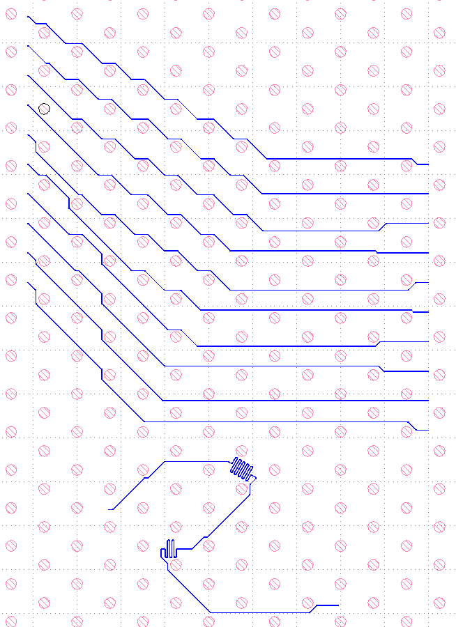
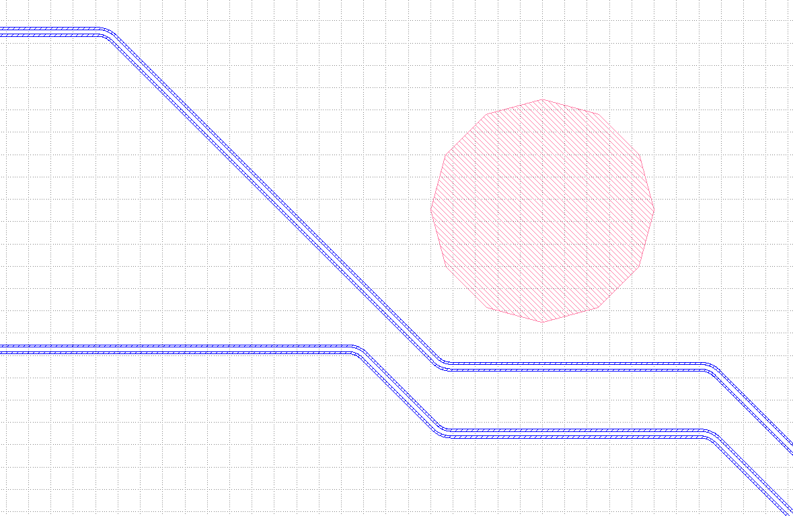

# tool

## 自动布线




```python
err, lengths = paintlib.AutoRoute.autoRoute(
    cell, layer, size, cellList, brushs,
    layerList, box, layermod, order)
if not err:
    print(lengths)
```

把图形区域栅格化后两两连线

+ `cell,layer`是连线要放入的地方
+ `size`是栅格化的尺寸
+ `cellList`要栅格化的cell列表, 一般填顶层cell`[top]`就可以
+ `brushs`是成对的笔刷的列表
+ `layerList`是要排除的或要加入层的列表
+ `box`是栅格化以及连线的区域
+ `layermod`决定层的列表是加入`'in'`还是排除`'not in'`
+ `order`是连线顺序, `None`按顺序连, `['distance']`会先两两连一次算距离,  
  并按照距离从小到大连, 填索引数组会按照给定的顺序连

当返回的`err`无错误时, `lengths`是所有实际连线的长度列表

完整例子见[demos/autoRouteDemo.py](files/?../../demos/autoRouteDemo.py ':ignore')

## 交互式的路径生成

1. 在绘图过程中, 使用`paintlib.Interactive.show(brush)`标记需要连接的笔刷, 此时笔刷会以电极的形式画在auxiliary中.

2. 选中(0,0)层, 用工具栏中的path点出一条路径并选中.

3. 在命令行中输入`paintlib.Interactive.link()`, 会自动搜索最近的笔刷拟合出路径, 生成路径函数打印在命令行中, 并在auxiliary中画出.

<p>

<span style="float:left">&nbsp;&nbsp;&nbsp;&nbsp;</span>

</p><br style="clear:both">

```python
def path(painter):
    length=0
    length+=painter.Straight(493628.3218813461)
    length+=painter.Turning(-50000,45.0)
    length+=painter.Straight(390557.7026663276)
    length+=painter.Turning(-50000,90)
    length+=painter.Straight(630063.254735586)
    length+=painter.Turning(-50000,45)
    length+=painter.Straight(330724.32188134524)
    length+=painter.Turning(50000,90)
    length+=painter.Straight(587893.3218813452)
    length+=painter.Turning(50000,45)
    length+=painter.Straight(545793.0969808981)
    length+=painter.Turning(50000,90)
    length+=painter.Straight(517921.7760936491)
    length+=painter.Turning(-50000,45.0)
    length+=painter.Straight(683581.3218813452)
    return length
```

## 图块化的路径函数生成器

<a href="./tool/pathGenerator.html" style="color:navy;" target="_blank_">点此进入</a>

如下图所示, 拖拽图块, 便可生成路径函数, 画出对应的腔


可以点击`Show XML`, 把生成如下的内容的保存下来. 需要编辑时再在粘贴到输入框中点`Load XML`, 即可恢复图块.

```xml
<xml xmlns="http://www.w3.org/1999/xhtml">
  <variables></variables>
  <block type="pathgenerator" id="PY8{DktMB_WpN|,[8R/F" x="269" y="145">
    <statement name="pathstat_0">
      <shadow type="void" id="Dug+93UZdM];]LS1+?wR"></shadow>
      <block type="leftright" id="9CmP#M$d+WRz4}{xy;v!">
        <field name="LeftRight_List_0">right</field>
        <field name="Number_0">40000</field>
        <field name="Number_1">90</field>
        <next>
          <block type="go" id="ZieE*aY1*=XwS*8N8G)U">
            <field name="Number_0">50000</field>
            <next>
              <block type="leftright" id="yoSi3wS/X}d_*tm%/-h0">
                <field name="LeftRight_List_0">right</field>
                <field name="Number_0">40000</field>
                <field name="Number_1">90</field>
                <next>
                  <block type="repeat" id="74`{P8k_%JjZn^zR]Q=i">
                    <field name="Int_0">7</field>
                    <statement name="pathstat_0">
                      <shadow type="void" id="Uj;.8h?(nXyl`?a==`vc"></shadow>
                      <block type="go" id="@2t1Y[|iuZ/rj+(=k-v`">
                        <field name="Number_0">500000</field>
                        <next>
                          <block type="leftright" id="z0JeN]fam,$JqhA$i{.#">
                            <field name="LeftRight_List_0">left</field>
                            <field name="Number_0">40000</field>
                            <field name="Number_1">180</field>
                            <next>
                              <block type="go" id="DiMW3ma|[A=G.g-@{+)x">
                                <field name="Number_0">500000</field>
                                <next>
                                  <block type="leftright" id="peq2OA6hzFJ_$(wR.8E.">
                                    <field name="LeftRight_List_0">right</field>
                                    <field name="Number_0">40000</field>
                                    <field name="Number_1">180</field>
                                  </block>
                                </next>
                              </block>
                            </next>
                          </block>
                        </next>
                      </block>
                    </statement>
                    <next>
                      <block type="go" id="@|-9I7@_C9K_(-(i!#:R">
                        <field name="Number_0">28500</field>
                      </block>
                    </next>
                  </block>
                </next>
              </block>
            </next>
          </block>
        </next>
      </block>
    </statement>
  </block>
</xml>
```

## 生成所有标记的位置坐标

生成layer(0,1)中所有图形左下角的坐标

```python
marks = paintlib.Interactive.scanBoxes()
paintlib.IO.Show()
import json
print(json.dumps(marks,indent=4))
```